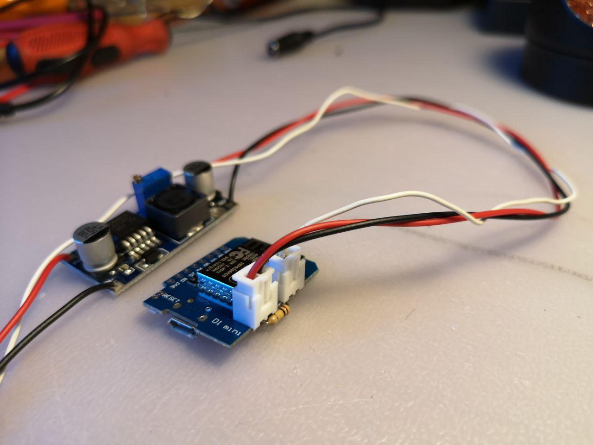
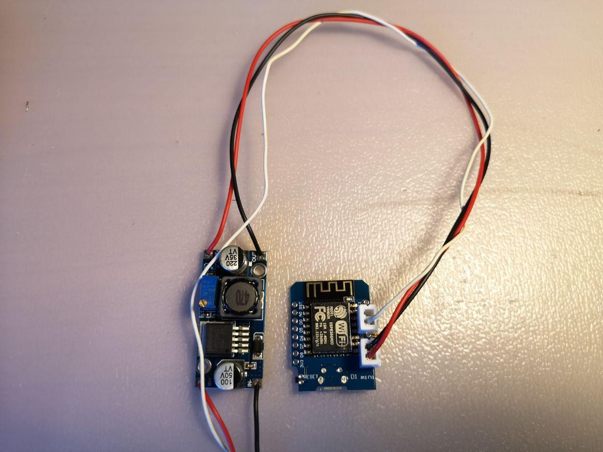
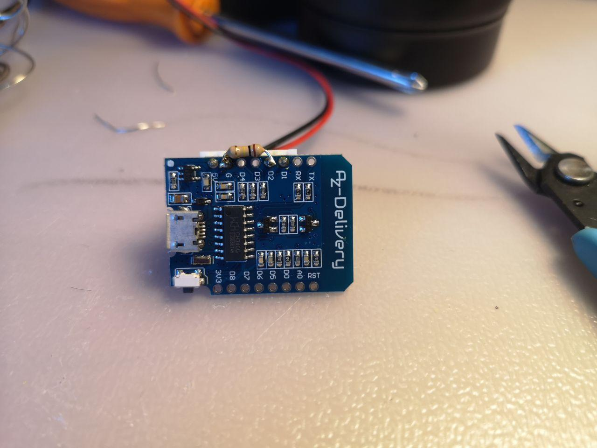
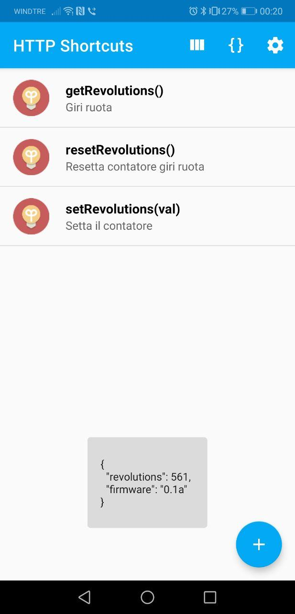

# ESP Odometer

ESP Odometer is a simple WiFi-enabled device that counts and stores the number of tire revolutions and exposes this value through REST API.

The revolutions counter is stored on internal EEPROM, so power on/off cycles doesn't clear it.

Tested on ESP8266 WeMos D1 Mini on Suzuki SV650 (1999-2002) equipped with a stock speed sensor.

## API

| PATH | METHOD | PARAMS | DESCRIPTION |
|-|-|-|-|
| / | GET | | Get current revolutions value |
| /reset | POST | | Reset internal revolutions counter to 0 |
| /set | POST | revolutions (int) | Set internal revolutions counter to an arbitrary value |

Params are sent via x-www-form-urlecoded.
All requests produces the same JSON response, for example:

```
{
  "revolutions": 19245,
  "firmware": "0.1a"
}
```

Curl examples:

```
curl -X GET http://192.168.4.1/
curl -X POST http://192.168.4.1/reset
curl -X POST http://192.168.4.1/set --data "revolutions=19245"
```


## Configuration

```
#define WIFI_ESSID "SV650"
#define WIFI_PASSWORD "12345678"
#define SERVER_PORT 80
#define TRIGGER_STEP 4
#define DEBUG 1
#define DEBUG_SERIAL_BAUDRATE 115200
#define SIMULATE 0
```

- DEBUG = 0: debug disabled.
- DEBUG = 1: debug output enabled.
- DEBUG = 2: verbose debug output.
- SIMULATE = 0: real working, no simulation.
- SIMULATE = 1: reed sensor reading is disabled, the revolutions counter increase automatically every second.
- TRIGGER_STEP: the number of impulse generate by a single tire revolution. It depends on your speed sensor, 4 or 8 is a common value.





